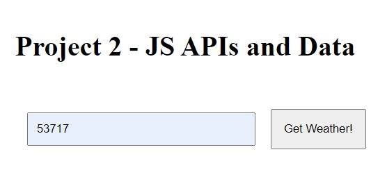
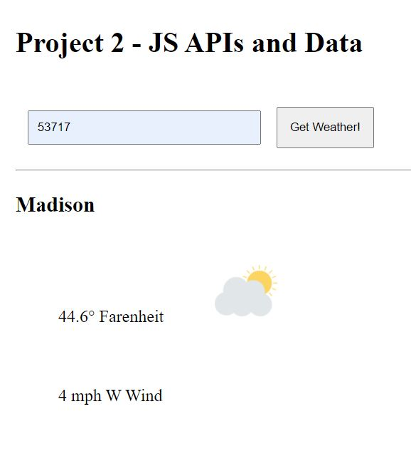

# Gets weather
This application based on a provided zipcode gets city name, temperature, wind speed, wind direction  
and outputs it to the view. The provided data are gathered with the help  
of [Geonames](http://www.geonames.org/) api

---
 ### Screenshots
  <h4 align="left"> Input</h4>
    
  <h4 align="left"> Output</h4>
    
 
